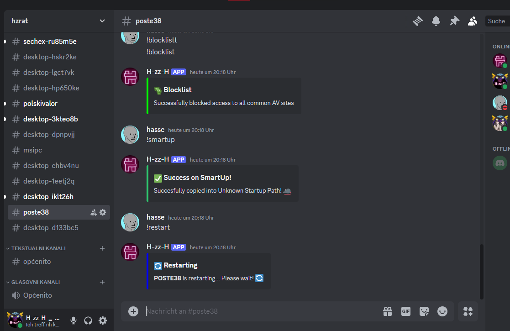
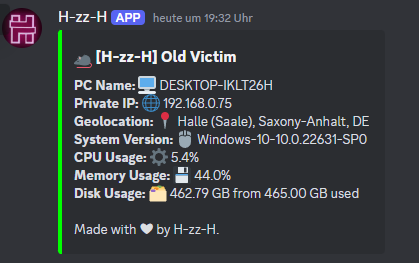

# Hello ❤

# Features:

## 📊 System Info & Monitoring
- `!information` — Sends system info 🖥️  
- `!disk` — Disk space 📦  
- `!cpu` — CPU usage ⚙️  
- `!ram` — RAM usage 💾  
- `!overview` — CPU, RAM, Disk overview 🛠️  
- `!battery` — Battery status 🔋  
- `!publicip` — Victim's public IP 🌐  

---

## 🌐 Network
- `!network` — List WiFi networks with saved passwords 🌐  
- `!net_pass (wifi_name)` — Get password for specific WiFi 🌐  
- `!net` — Create/Recreate botnet channel ⚡  
- `!botnet (url)` — Start DDoS attack ⚡  
- `!botnet_stop` — Stop DDoS attack ⚡  

---

## 📷 Visual Capture
- `!screen` — Take a screenshot 🖼️  
- `!webcam` — Capture webcam image 📸  
- `!recscreen (sec)` — Record screen for X seconds  
- `!recwebcam (sec)` — Record webcam for X seconds  
- `!recaudio (sec)` — Record audio for X seconds 🎤  

---

## 📁 File & Directory
- `!list` — List files in current directory 📂  
- `!cd (path)` — Change directory  
- `!download (path)` — Download file (10MB limit) 📥  
- `!download_ext (file.png)` — Download large file (100MB) 📥  
- `!upload (attachment) (!path!)` — Upload file (10MB limit) 📤  
- `!upload_ext (URL) (!path!)` — Upload from URL (no limit) 📤  
- `!exec (path)` — Execute file  
- `!encrypt (*) or (file.ext)` — Encrypt files to `.hzzh` ⚽  

---

## ⌨️ Keylogger
- `!keylog_start` — Start keylogger  
- `!keylog_dump` — Dump logged keys  
- `!keylog_stop` — Stop keylogger  

---

## 🎭 Execution & Tricks
- `!error (Title | Text)` — Show fake error ⚠️  
- `!web_open (url)` — Open a URL 🌍  
- `!command (cmd)` — Execute command 💻  
- `!shell (cmd)` — Execute PowerShell 💻  
- `!tasks` — List running tasks 📝  
- `!taskkill` — Kill task by name  
- `!fakecmd (amount)` — Flash fake CMDs 💻  
- `!cmdspam` — Spam CMDs until crash 💻  

---

## 🔧 Persistence & Privilege
- `!startup` — Add to startup 🐀  
- `!smartup` — Unknown startup path 🐀  
- `!getadmin` — Request Admin via UAC spam  
- `!admin` — Check admin status 🛠️  
- `!closesession` — Close other user sessions 💻  

---

## 🔐 Admin-Only
- `!taskmgr` — Disable Task Manager 🎰  
- `!taskmgr_enable` — Enable Task Manager 🎰  
- `!blocklist` — Block AV-related sites 🦠  
- `!unblocklist` — Unblock AV-related sites 🦠  
- `!nostartup` — Hide Startup folder access 🔒🗂️  
- `!nostartup_disable` — Restore Startup folder access 🔓🗂️  
- `!critproc` — Make process critical (BSOD on kill) 🆙  
- `!uncritproc` — Remove critical status 🆙  
- `!windef` — Disable Windows Defender 🛡️  
- `!exclude_exe` — Exclude all `.exe` from Defender 🐀  
- `!block` — Block/Unblock input devices 🖱️⌨️  

---

## 🧪 Troll Features
- `!screensaver` — Activate fake screensaver  
- `!floatpic (sec) (url)` — Floating unclosable image  
- `!logout` — Log out user (Win+L)  
- `!reverse` — Reverse mouse movement 🖱️🔄  
- `!jumpscare` — Loud scary popup 😱🔊  
- `!cpufuck` — Max CPU to 100% ⚡💻  
- `!bluescreen` — Trigger BSOD 💥🖥️  
- `!shaking` — Mouse shake effect 💥🖱️  

---

## 💬 Discord Management
- `!purge (amount)` — Delete messages 🚮  
- `!recreate (#channel)` — Delete & recreate channel 🔄  

# Soon

- Rat Builder with GUI!
- Plugins Options to add custom features!
- `!browser` - Steals Password, History, Cookies and shiii.

## [Setup](https://www.youtube.com/watch?v=3AtgXzT03hU):
Install [Python 3.9.11](https://www.python.org/downloads/release/python-3911/)

Change the token on line 146, and you're good to go! ⚡

If you want, feel free to read through the details below. 📖

---

## About This RAT

This RAT was created by H-zz-H.

If you have any questions or need assistance, you can reach me on Discord: h_zz_h or join my server: [Discord Server](https://discord.gg/29Ya4F3CgQ).

As of February 23, 2025, I have posted a cracked open-source Discord Stealer in my Discord server. Normally, this would cost over €120 for lifetime access.

Join my Discord for:

- Coding help 🤖
- Troubleshooting errors related to this RAT 🛠️
- New ideas, projects, or feature suggestions 💡

If you'd like to add new features or improve this RAT, go ahead! Feel free to share your work with me on Discord. 🙌

I will update and maintain this project as long as I have time. If I stop, well... I don’t know. ⏳

---

## Disclaimer

- I am not responsible for any misuse of this RAT. ⚠️
- I am not liable for any damage caused by this software. 💥
- Use it at your own risk. ⚡

---

## Skidded Sources

I’ve used some code from the following sources:

- [Blank Grabber](https://github.com/Blank-c/Blank-Grabber) – The !blocklist and !unblocklist commands are almost fully skidded, with some modifications to fit my project. 🔄
- [Discord-RAT by moom825](https://github.com/moom825/Discord-RAT) – This project inspired me to start mine. Special thanks to moom825. 👏
- [Chat GPT](https://chatgpt.com/) – The !floatpic !cd and !list commands are ChatGPT generated 🙄

The !uncritproc and !critproc commands are directly from moom825’s RAT. 💻

Many features are similar because I needed working implementations, and his GitHub page was full of great ideas. 💡

---

## Final Words

Thanks for taking the time to read this. ❤️

Love y’all. Bye. 👋

~~~
H-zz-H - https://discord.gg/29Ya4F3CgQ - _h_zz_h_
~~~

---

## All Features of the RAT:

### System Information
- `!information` – Sends your system information 🖥️
- `!disk` – Sends used disk space 📦
- `!cpu` – Shows current CPU usage ⚙️
- `!ram` – Shows current RAM usage 💾
- `!overview` – Shows all information for CPU, RAM, and Disk 🛠️
- `!network` – Lists all WiFi networks with passwords 🌐
- `!net_pass (WiFi name)` – Outputs the password of the selected WiFi 🔑
- `!publicip` – Get Public IP of Victim 🌍
- `!battery` – Shows battery status (if laptop) 🔋
- `!webcam` – Captures and sends a webcam image 📸
- `!screen` – Takes a screenshot 🖼️
- `!tasks` – Lists current running tasks 📝

### System Control
- `!web_open (URL)` – Opens a URL in the browser 🌍
- `!fakecmd (amount)` – Quickly flashes (amount) CMD windows 💻
- `!cmdspam` – Spams CMD windows until the system crashes 💥
- `!command (command)` – Executes a given command 💻
- `!running` – Shows how many PCs the RAT is running on 🌍
- `!botnet (URL)` – Starts a DDoS attack on a specific server ⚡
- `!botnet_stop` – Stops the DDoS attack ⚡
- `!startup` – Adds RAT to startup using five different unknown methods 🐀
- `!error (Title) | (Text)` – Displays a fake error message ⚠️
- `!shutdown` – Shuts down the victim's PC 🛑
- `!restart` – Restarts the victim's PC 🔄

### File Management
- `!cd (path)` – Change to another directory 🛠️
- `!list` – Lists all files in the current directory 📂
- `!download (file/path)` – Downloads a file from the victim's PC (10MB max) 📥
- `!download_ext (file.png)` – Downloads a file from the victim's PC (100MB max) 📥
- `!upload (attachment) (!path!)` – Uploads a file to the victim's PC 📤
- `!exec (path)` – Executes a file ⚙️

### Permissions & Security
- `!admin` – Checks for admin permissions 🛠️
- `!getadmin` – Attempts to gain admin privileges by spamming UAC prompts 🛠️
- `!clipboard` – Retrieves clipboard contents 📋
- `!wallpaper (attachment.png)` – Changes the victim's wallpaper 🖼️
- `!closesession` – Closes additional sessions on the same PC 💻

### Keylogging & Encryption
- `!keylog_start` – Starts capturing keystrokes ⌨️
- `!keylog_dump` – Sends recorded keystrokes (must stop keylogger first) ⌨️
- `!keylog_stop` – Stops keylogging ⌨️
- `!encrypt (*) or (file.extension)` – Encrypts all files in the directory to .hzzh ⚽
- `!tokens` – Retrieves Discord tokens 🎁

### Admin-Only Features
- `!taskmgr` – Disables Task Manager 🎰
- `!taskmgr_enable` – Enables Task Manager 🎰
- `!blocklist` – Blocks access to common antivirus sites 🦠
- `!unblocklist` – Unblocks access to common antivirus sites 🦠
- `!nostartup` – Blocks user access to the startup folder 🔒🗂️
- `!nostartup_disable` – Restores user access to the startup folder 🔓🗂️
- `!critproc` – Makes the RAT a critical process (closing = bluescreen) 🆙
- `!uncritproc` – Removes critical process status 🆙
- `!smartup` – Uses an unknown startup path 🐀

### Troll Features
- `!floatpic (seconds) (URL)` – Displays an unclosable floating image 🖼️
- `!screensaver` – Shows an auto-installed screensaver 🖥️

### Discord Features
- `!purge (amount)` – Deletes a specified number of messages 🚮
- `!recreate (#channel)` – Deletes and recreates a channel 🔄
- `!net` – Creates/Recreates the botnet channel ⚡

Made with ❤ by H-zz-H

### Example Images:

#### Discord Chat Interaction

This image shows someone using the commands, and the bot responding to them.

#### Startup Message

This image shows the startup message of someone starting the RAT—looks hot! 🔥
